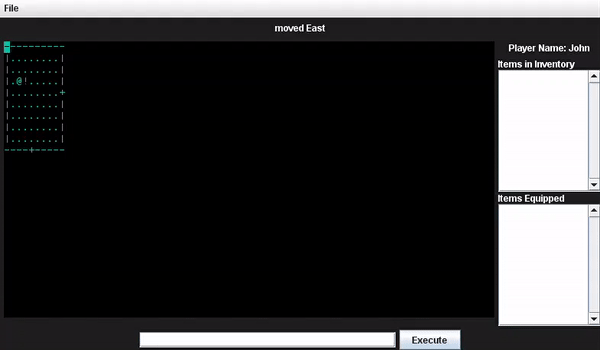

# Rogue Game

A rogue game made using Java and swing! This was a school project I completed in second year in my Object Oriented Programming ([CIS 2430](https://www.uoguelph.ca/registrar/calendars/undergraduate/2018-2019/courses/cis2430.shtml)) course

### Main Acomplishments

* Developed an ASCII roguelike game where the user can move through various rooms picking up and
using items
* Created a GUI to show the current room as well as the player’s items with the option to open
previously saved game states
* Applied fundamental Object-Oriented Design concepts such as polymorphism, abstraction, and the
single-responsibility principle

### Compiling and Running the Program

First to compile the program make sure you have gradle installed. Then enter `gradle build` to compile all the necessary files. Finally to run the program use `java -jar build/libs/A3.jar` or `gradle run`

### Controls

| Key | Action         |
|-----|----------------|
|  r  |   MOVE UP      |
|  g  |   MOVE RIGHT   |
|  f  |   MOVE DOWN    |
|  d  |   MOVE LEFT    | 
|  e  |   EAT ITEM     |
|  w  |   WEAR ITEM    |
|  t  |   TOSS ITEM    |
